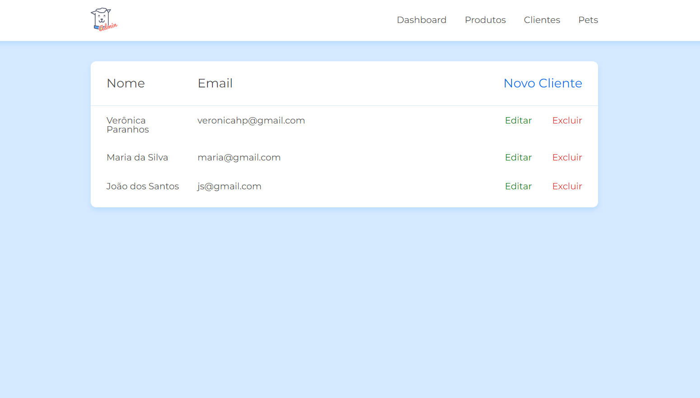

#  JS na web: CRUD com JavaScript assíncrono

> Projeto realizado durante o curso de CRUD que é um acrônomo para as palavras em inglês create, read, update e delete. 

 

 

⚠️ Durante o desenvolvimento do projeto utilizamos o json-server para simular um servidor e consumir dados.

